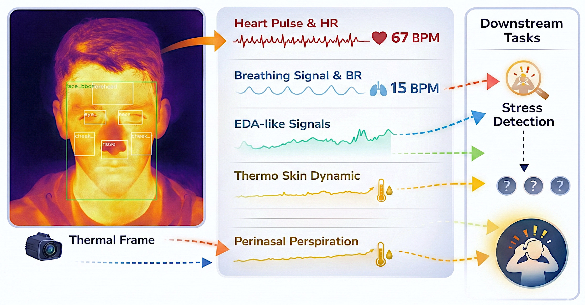
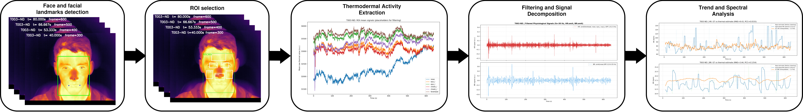
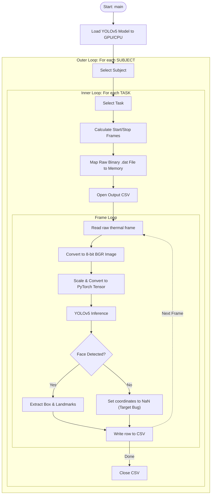
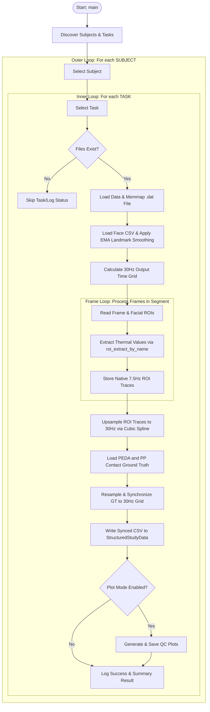
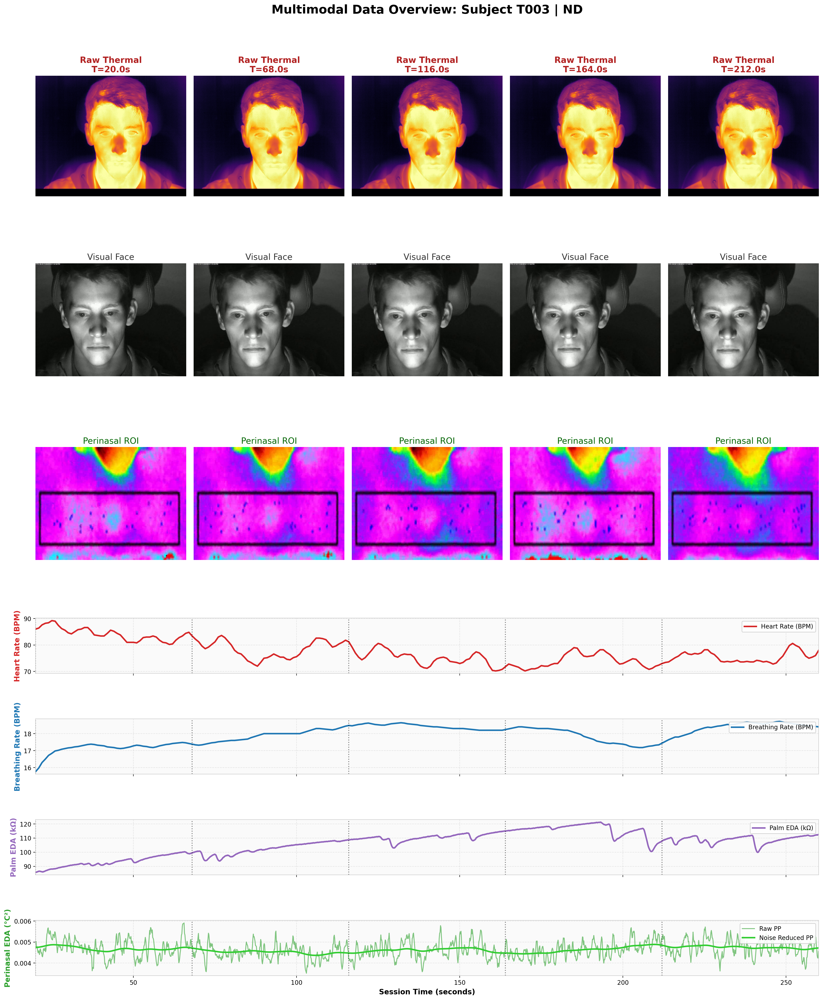

# Thermal Imaging for Contactless Cardiorespiratory and Sudomotor Response Monitoring

[](https://www.gnu.org/licenses/gpl-3.0)
[](https://www.python.org/downloads/)
[](https://arxiv.org/abs/2602.12361)

This repository contains the signal processing pipeline described in our paper:

> **Thermal Imaging for Contactless Cardiorespiratory and Sudomotor Response Monitoring.**
> Constantino Álvarez Casado, Mohammad Rahman, Sasan Sharifipour, Nhi Nguyen,
> Manuel Lage Cañellas, Xiaoting Wu, Miguel Bordallo López.
> *Center for Machine Vision and Signal Analysis (CMVS), University of Oulu, Finland*.
> Preprint: https://arxiv.org/abs/2602.12361

---

## Overview

Thermal infrared cameras capture skin temperature changes driven by autonomic regulation and can provide **contactless estimation** of:

- **EDA** (electrodermal activity / sudomotor response) — slow thermal trends driven by eccrine sweating
- **BR** (breathing rate) — temperature oscillations at the perinasal region during respiration
- **HR** (heart rate) — weak pulsatile signal from superficial vessels (limited by frame rate)



The pipeline tracks six anatomical facial ROIs, applies spatial aggregation, and separates slow sudomotor trends from faster cardiorespiratory components. Evaluation is on the public [SIMULATOR STUDY 1 (SIM1)](https://osf.io/c42cn/) dataset with synchronized contact ground truth.

---

## Pipeline



The pipeline consists of six stages, implemented as numbered scripts:

| Step | Script | Description |
|------|--------|-------------|
| 1 | `mmslab_sim1_01_download_rawthermal.py` | Download raw `.dat`/`.inf` thermal recordings from OSF |
| 2 | `mmslab_sim1_02_download_structured_data.py` | Download synchronized CSVs and ground-truth signals |
| 3 | `mmslab_sim1_03_explore_dataset_structure.py` | Inspect the downloaded dataset structure |
| 4 | `mmslab_sim1_04_visualize_rawthermal.py` | Preview raw thermal video as an MP4 animation |
| 5 | `mmslab_sim1_05_detect_face_landmarks.py` | Detect face bounding boxes and 5 landmarks (YOLOv5-Face + TFW weights); outputs per-session annotation CSVs |
| 6 | `mmslab_sim1_06_extract_roi_sync_gt.py` | **Batch**: extract ROI temperature traces, upsample to 30 Hz, synchronize with contact GT (HR, BR, PP, PEDA) |
| 7 | `mmslab_sim1_07_visualize_roi_signals.py` | Visualize synchronized ROI traces alongside ground-truth signals |
| 8 | `mmslab_sim1_08_extract_eda_signals.py` | Extract slow sudomotor trends (288 ROI × method configurations) and compute agreement metrics |
| 9 | `mmslab_sim1_09_extract_hr_br_signals.py` | Extract HR and BR using OMIT decomposition + Welch spectral estimator |

> Single-session reference scripts for step 6: `mmslab_sim1_06_extract_roi_sync_gt_single.py` and `mmslab_sim1_06_sync_gt_from_roi_csv.py`.

---

## Script 5: YOLOv5 Execution Flow


---

##Script 6: Sync GT from ROI CSV


## Dataset: SIMULATOR STUDY 1

The [SIM1 dataset](https://osf.io/c42cn/) (Taamneh et al., 2017) provides:
- Raw LWIR thermal video at **7.5 fps**, 640×512 pixels (FLIR Tau 640)
- Synchronized contact signals: palm EDA (PEDA), perinasal perspiration (PP / PP\_NR), HR, BR
- 68 subjects performing a driving simulation under 5 conditions: BL (baseline), PD (practice drive), ND (normal drive), CD (cognitive distraction), ED (emotional distraction)

The paper evaluates 8 subjects (T002, T003, T005, T014, T029, T031, T034, T036) × 4 tasks = 31 sessions.



---

## Key Results

| Signal         | Best configuration | Performance |
|----------------|--------------------|-------------|
| rEDA vs PEDA   | Nose ROI, exponential moving average | PCC\_abs = 0.40 ± 0.23 (peak 0.89) |
| rEDA vs PP\_NR | Cheeks ROI, exponential moving average | PCC\_abs = 0.32 ± 0.18 |
| BR             | Nose + cheeks average, Welch spectral estimator | MAE = 3.1 ± 1.1 bpm |
| HR             | OMIT multi-ROI decomposition | MAE = 13.8 ± 7.5 bpm (limited by 7.5 Hz frame rate) |

---

## Installation

```bash
# Clone the repository
git clone https://github.com/MMLSLab/oulu-human-thermal-sensing.git
cd oulu-human-thermal-sensing

# Create and activate the conda environment
./install.sh
# or manually:
conda env create -f environment.yml
conda activate oulu-thermal
```

For the face detection step (step 5) you additionally need the [yolov5-face](https://github.com/deepcam-cn/yolov5-face) repository and the [TFW](https://github.com/IS2AI/TFW) thermal weights (`yolov5s_face.pt`).

---

## Usage

All scripts are configured via a `CONFIGURATION` block at the top of each file — edit `BASE_PATH`, `SUBJECT`, `TASK`, and other parameters before running.

```bash
# 1. Download raw thermal data
python scripts/mmslab_sim1_01_download_rawthermal.py

# 2. Download structured data (synchronized CSVs + ground truth)
python scripts/mmslab_sim1_02_download_structured_data.py

# 3. Inspect dataset structure
python scripts/mmslab_sim1_03_explore_dataset_structure.py

# 4. Preview a raw thermal recording
python scripts/mmslab_sim1_04_visualize_rawthermal.py

# 5. Detect face landmarks and export annotation CSVs
python scripts/mmslab_sim1_05_detect_face_landmarks.py

# 6. Extract ROI traces from raw thermal and synchronize with ground truth (batch)
python scripts/mmslab_sim1_06_extract_roi_sync_gt.py

# 7. Visualize synchronized ROI signals alongside ground truth
python scripts/mmslab_sim1_07_visualize_roi_signals.py

# 8. Extract EDA trends and compute agreement metrics
python scripts/mmslab_sim1_08_extract_eda_signals.py

# 9. Extract HR and BR using OMIT + Welch spectral estimator
python scripts/mmslab_sim1_09_extract_hr_br_signals.py
```

---

## Repository Structure

```
scripts/          Sequential processing pipeline (steps 1–9)
src/
  filtering/      Signal filter library (IIR, FIR, non-linear filters)
  utils/          YOLOv5-face inference utilities (see src/utils/README.md)
  roi_extraction_methods.py   Spatial aggregation functions for thermal ROI patches
models/           Model weights directory (see models/README.md)
data/
  sim1_face_demo/ Sample thermal face frames
  images/         Overview figures
docs/images/      Figures used in this README
```

### Third-party code and models

**`src/utils/`** contains utilities adapted from the
[yolov5-face](https://github.com/IS2AI/AnyFace/tree/main/yolov5-face/utils)
repository, included for development and testing of the face landmark detection
step. See [`src/utils/README.md`](src/utils/README.md) for details.

**`models/`** is a placeholder for the YOLOv5-Face weights trained on thermal
faces by the [TFW project](https://github.com/IS2AI/TFW?tab=readme-ov-file).
Download `yolov5s_face.pt` from that repository and place it in `models/`.
See [`models/README.md`](models/README.md) for instructions.

---

## Citation

If you use this code or the findings in your work, please cite:

```bibtex
@article{alvarez2025thermal,
  title   = {Thermal Imaging for Contactless Cardiorespiratory and Sudomotor Response Monitoring},
  author  = {\'Alvarez Casado, Constantino and Rahman, Mohammad and Sharifipour, Sasan
             and Nguyen, Nhi and Lage Ca\~nellas, Manuel and Wu, Xiaoting
             and Bordallo L\'opez, Miguel},
  journal = {arXiv preprint arXiv:2602.12361},
  year    = {2025},
  url     = {https://arxiv.org/abs/2602.12361}
}
```

---

## Authors

- **Constantino Álvarez Casado** — constantino.alvarezcasado@oulu.fi
- **Mohammad Rakib Rahman** — mohammad.r.rahman@oulu.fi
- **Sasan Sharifipour** — sasan.sharifipour@oulu.fi
- **Miguel Bordallo López** (team lead) — miguel.bordallo@oulu.fi

Center for Machine Vision and Signal Analysis (CMVS), University of Oulu, Finland

---

## License

This project is licensed under the [GNU General Public License v3.0](LICENSE).
